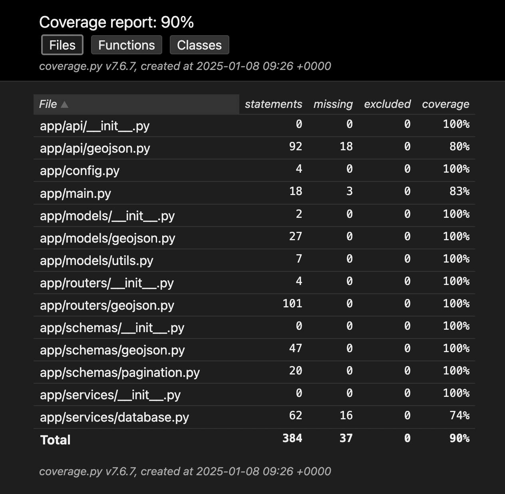
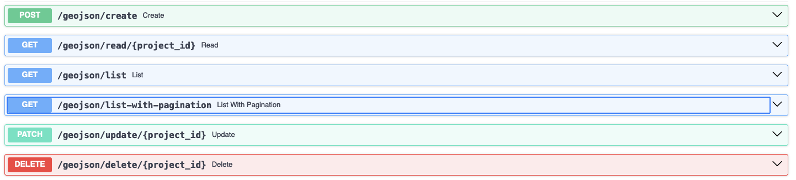
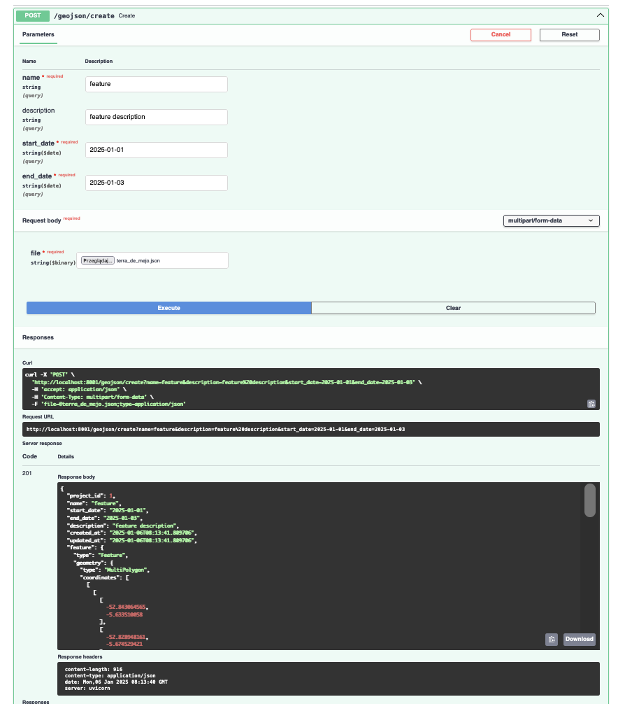
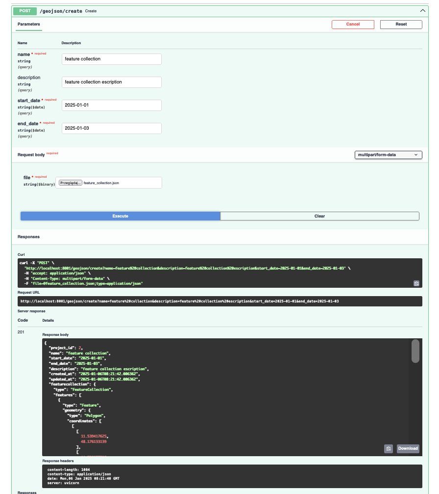
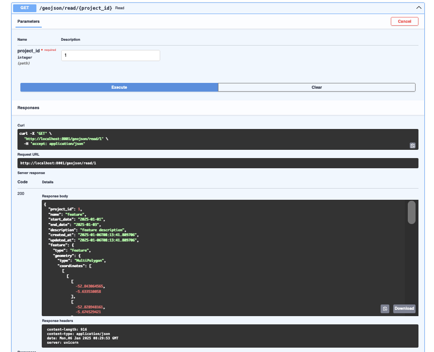
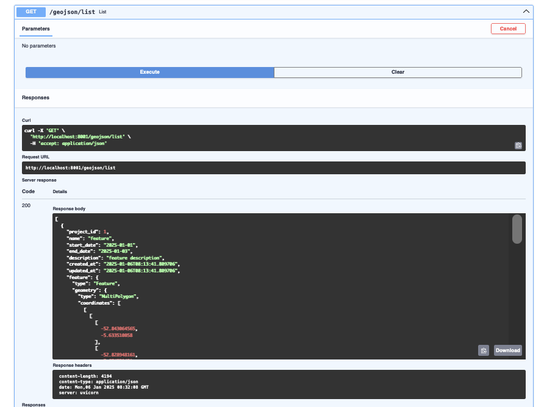
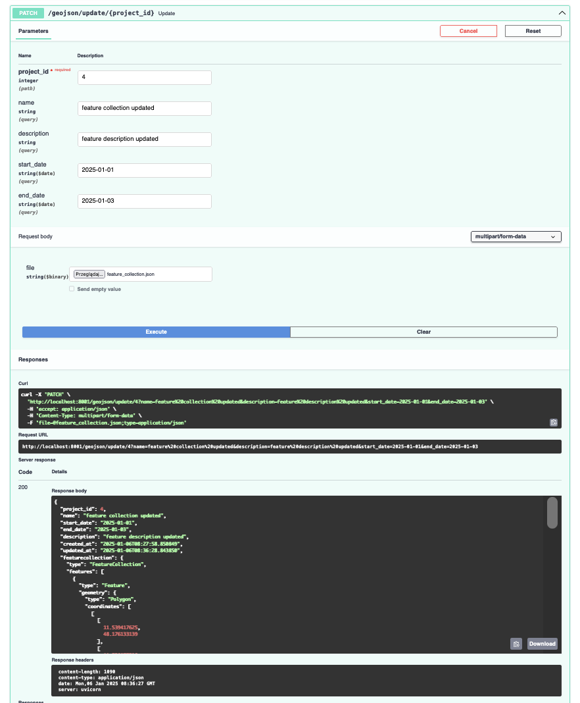
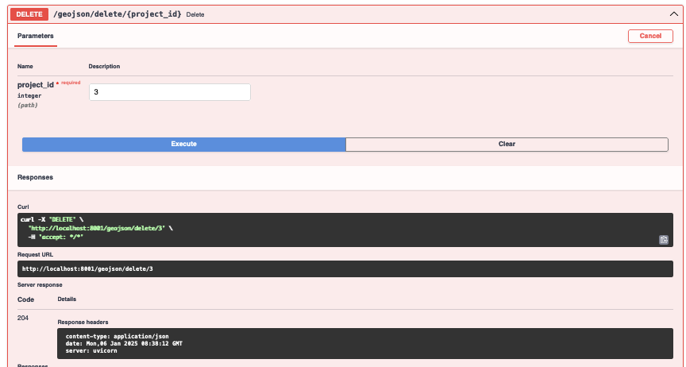

Test repo with crud for geoJSON file format.

Table of Contents
=================

* [GEOJSON CRUD](#geojson-crud)
  * [Description](#description)
    * [Supported operations](#supported-operations)
    * [Basic project attributes](#basic-project-attributes)
    * [Technical requirements](#technical-requirements)
    * [Database schema](#database-schema)
  * [Application in a container](#application-in-a-container)
    * [Launching the container](#launching-the-container)
    * [Launching bash in geojson\-crud\-backend container](#launching-bash-in-geojson-crud-backend-container)
    * [Database migration \- alembic](#database-migration---alembic)
    * [Running tests](#running-tests)
    * [Preparing tests coverage](#preparing-tests-coverage)
      * [Coverage report](#coverage-report)
  * [Swagger](#swagger)
    * [Implemented endpoints](#implemented-endpoints)
    * [Create examples](#create-examples)
    * [Read example](#read-example)
    * [List example](#list-example)
    * [Update example](#update-example)
    * [Delete example](#delete-example)
  * [Bibliography](#bibliography)

# GEOJSON CRUD

## Description

“Project” is a plot of land, that we will be analyzing
by utilizing the satellite imagery captured in selected date range.

### Supported operations

* Create
* Read
* List
* Delete
* Update

### Basic project attributes

* name (required, character limit, up to 32 characters)
* description (optional)
* date range: start_date and end_date (required)
* file - geoJSON file (required)

### Technical requirements

* FastAPI framework used
* projects are persisted in postgresql with postgis extension
* geoJSON files are validated using `geojson-pydantic` library
* test coverage is performed
* dockerfile / docker-compose are provided to run the application in a container

### Database schema

There are 2 tables created: `Projects` and `Features`.

There is a unique index created for Projects table (`name`, `start_date`, `end_date`).

`projects` table schema:
```sql
                                                                          Table "public.projects"
      Column      |            Type             | Collation | Nullable |                   Default                    | Storage  | Compression | Stats target | Description
------------------+-----------------------------+-----------+----------+----------------------------------------------+----------+-------------+--------------+-------------
 project_id       | bigint                      |           | not null | nextval('projects_project_id_seq'::regclass) | plain    |             |              |
 name             | character varying(32)       |           | not null |                                              | extended |             |              |
 description      | character varying(255)      |           |          |                                              | extended |             |              |
 start_date       | date                        |           | not null |                                              | plain    |             |              |
 end_date         | date                        |           | not null |                                              | plain    |             |              |
 geo_project_type | geo_project_type            |           | not null |                                              | plain    |             |              |
 bbox             | double precision[]          |           |          |                                              | extended |             |              |
 created_at       | timestamp without time zone |           | not null | now()                                        | plain    |             |              |
 updated_at       | timestamp without time zone |           | not null | now()                                        | plain    |             |              |
Indexes:
    "projects_pkey" PRIMARY KEY, btree (project_id)
    "projects_name_start_date_end_date_key" UNIQUE CONSTRAINT, btree (name, start_date, end_date)
Check constraints:
    "projects_check" CHECK (end_date >= start_date)
Referenced by:
    TABLE "features" CONSTRAINT "features_project_id_fkey" FOREIGN KEY (project_id) REFERENCES projects(project_id) ON DELETE CASCADE
Access method: heap
```

`features` table schema:
```sql
                                                              Table "public.features"
   Column   |   Type   | Collation | Nullable |                   Default                    | Storage  | Compression | Stats target | Description
------------+----------+-----------+----------+----------------------------------------------+----------+-------------+--------------+-------------
 feature_id | bigint   |           | not null | nextval('features_feature_id_seq'::regclass) | plain    |             |              |
 geometry   | geometry |           | not null |                                              | main     |             |              |
 properties | json     |           |          |                                              | extended |             |              |
 project_id | bigint   |           | not null |                                              | plain    |             |              |
Indexes:
    "features_pkey" PRIMARY KEY, btree (feature_id)
    "ix_features_project_id" btree (project_id)
Foreign-key constraints:
    "features_project_id_fkey" FOREIGN KEY (project_id) REFERENCES projects(project_id) ON DELETE CASCADE
Access method: heap
```

## Application in a container

### Launching the container

```bash
$ docker compose build
$ docker compose up
```

### Launching bash in geojson-crud-backend container

```bash
$ docker exec -it geojson-crud-backend bash
```

### Database migration - alembic

In `geojson-crud-backend` container:
```bash
root@04843519acac:/code# alembic upgrade head
```

### Running tests

In `geojson-crud-backend` container:
```bash
root@04843519acac:/code# pytest
```

### Preparing tests coverage

In `geojson-crud-backend` container:
```bash
root@04843519acac:/code# pytest --cov-report html:coverage_html --cov=app tests/
```

#### Coverage report



## Swagger

Swagger can be launched in a browser after [launching the container](#launching-the-container)

Swagger url: [http://localhost:8001/docs#/](http://localhost:8001/docs#/)

### Implemented endpoints



### Create examples




### Read example



### List example



### Update example



### Delete example



## Bibliography

1. GeoJSON specification: [geoJSON specification](https://stevage.github.io/geojson-spec/)
2. GeoJSON RFC 7946: [rfc7946](https://datatracker.ietf.org/doc/html/rfc7946)
3. GeoJSON geometry objects: [GeoJSON tutorial for beginners](https://medium.com/@dmitry.sobolevsky/geojson-tutorial-for-beginners-ce810d3ff169)
4. GeoJSON Feature and FeatureCollection: [Feature and FeatureCollection in GeoJSON](https://medium.com/@dmitry.sobolevsky/feature-and-featurecollection-in-geojson-f36ec38ebdb1)
5. GeoAlchemy 2 documentation: [GeoAlchemy2](https://geoalchemy-2.readthedocs.io/en/latest/index.html)
6. `geojson-pydantic` github source: [geojson-pydantic](https://github.com/developmentseed/geojson-pydantic/tree/main)
7. PostGIS intro workshop: [postgis-intro](https://postgis.net/workshops/postgis-intro/)
8. PostGIS book: [postgis-book](https://postgis.gishub.org/chapters/intro.html)
9. PostGIS in Action (O'Reilly): [PostGis in Action](https://learning.oreilly.com/library/view/postgis-in-action/9781617296697/)
